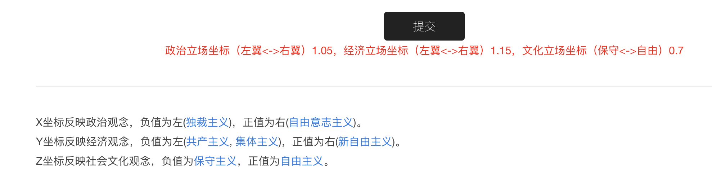
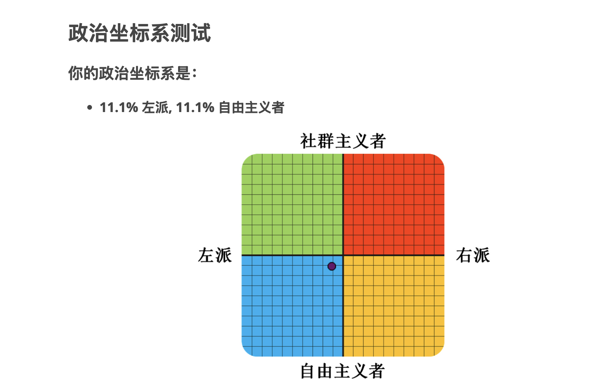

+ 政治测试网站1：<https://unnamed42.github.io/2017-03-16-%E4%B8%AD%E5%9B%BD%E6%94%BF%E6%B2%BB%E5%9D%90%E6%A0%87%E7%B3%BB%E6%B5%8B%E8%AF%95.html#comments>

+ 政治测试网站2：<https://www.idrlabs.com/cn/political-coordinates/test.php>

+ 六四博物馆：https://8964museum.com
+ 中国大饥荒档案馆：https://www.yhcw.net
+ [中华人民共和国历史](https://zh.wikipedia.org/zh-cn/%E4%B8%AD%E5%8D%8E%E4%BA%BA%E6%B0%91%E5%85%B1%E5%92%8C%E5%9B%BD%E5%8E%86%E5%8F%B2)
